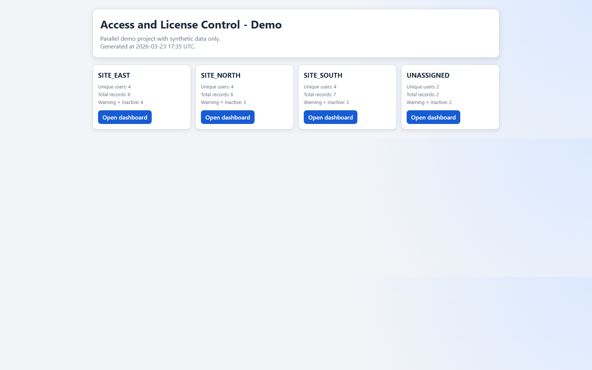
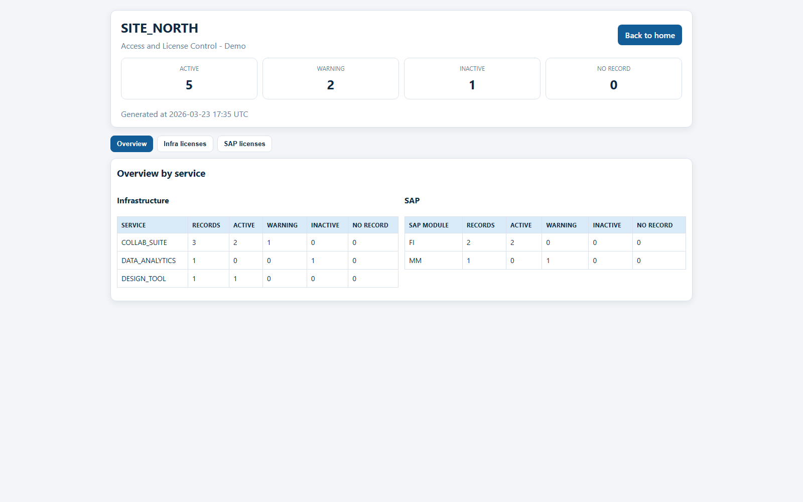
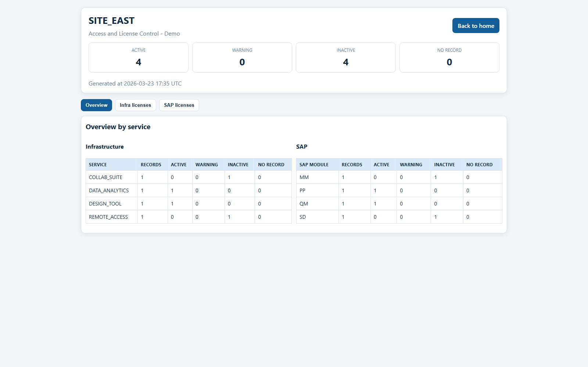
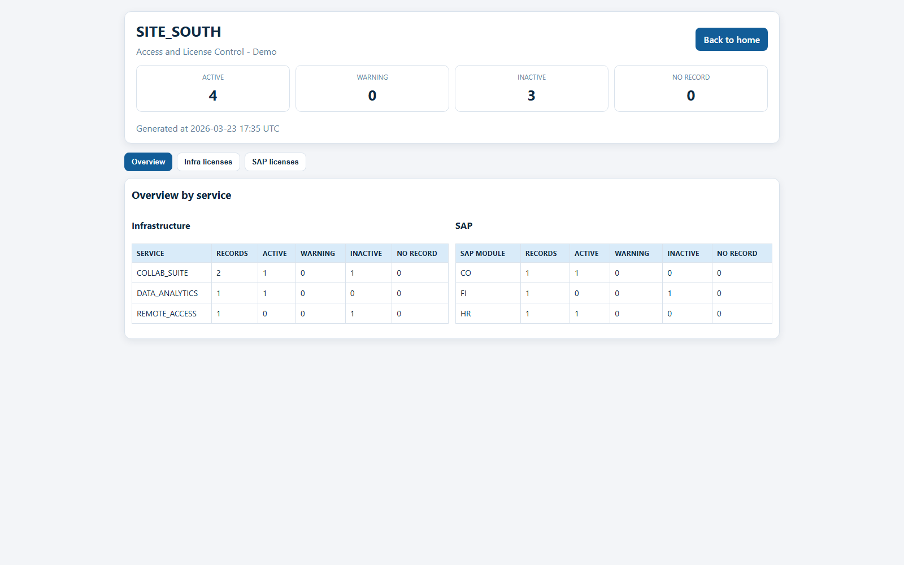

# License Dashboard — Histórico Técnico e Estado do Projeto

## 1. Visão Geral do Projeto

Este projeto gera **dashboards interativos para análise de uso e inatividade de licenças** em diferentes unidades organizacionais.

Os dashboards consolidam dados de múltiplas fontes corporativas para identificar:

* licenças inativas
* usuários sem atividade recente de login
* potenciais oportunidades de otimização de custo
* distribuição de licenças por unidade

A saída do sistema consiste em **dashboards HTML**, um para cada unidade, além de exportações em CSV e pacotes ZIP para distribuição.

O projeto foi desenvolvido inicialmente em um **ambiente corporativo restrito sem acesso a Git ou controle de versão**, portanto este documento registra as decisões técnicas e a arquitetura atual.

---

# 2. Fontes de Dados

O sistema integra **quatro fontes principais de dados**.

---

## 2.1 Base Mestre de Usuários

Arquivo Excel contendo o relacionamento principal entre usuário e licença.

Exemplo de arquivo:

```
user_license_base.xlsx
```

Aba utilizada:

```
user_list
```

Colunas importantes:

* User Name
* Product
* Location
* Email Address

Este arquivo representa **qual usuário possui qual licença**.

---

## 2.2 Parâmetros de Licenças

Planilha contendo o custo unitário das licenças.

Exemplo de aba:

```
license_parameters
```

Colunas:

* SERVICE
* PRICE

Finalidade:

Mapear **tipo de licença → custo unitário**.

---

## 2.3 Export de Atividade de Login

Arquivo CSV contendo histórico de atividade de login de usuários.

Exemplo de arquivo:

```
login_activity_export.csv
```

Colunas:

* DISPLAYNAME
* ACCOUNT_NAME
* LAST_LOGIN_DATE

Finalidade:

Fornecer **atividade de login dos usuários**, usada para determinar uso real da licença.

---

## 2.4 Lista de Usuários de Sistemas Corporativos

Arquivo Excel contendo informações adicionais de atividade em sistemas específicos.

Exemplo de arquivo:

```
system_user_activity.xlsx
```

Colunas:

* USER
* LAST_LOGIN
* CREATED_DATE

Finalidade:

Monitorar atividade de login **em sistemas específicos**, separadamente da base geral.

---

# 3. Pipeline Principal de Processamento

O pipeline de dados executa as seguintes etapas.

---

## Etapa 1 — Carregar Fontes

```
Base de usuários
Planilha de parâmetros de licença
Export de atividade de login
Base de atividade de sistemas específicos
```

---

## Etapa 2 — Normalização de Dados

A normalização inclui:

* remoção de acentos
* conversão para letras maiúsculas
* remoção de espaços extras

Função utilizada:

```
normalize_text()
```

Objetivo:

Evitar erros de correspondência entre bases.

---

## Etapa 3 — Criação da Chave de Junção

Os usuários são conectados através de uma chave normalizada:

```
USERNORM
```

Derivada de campos como:

```
ACCOUNT_NAME
```

A normalização garante que os merges sejam consistentes.

---

## Etapa 4 — Merge das Bases

Pipeline principal de merge:

```
Users + License Parameters
Users + Login Activity Export
Users + System Activity Data
```

Resultado:

```
df_merged
```

Este dataset torna-se a **base analítica principal**.

---

# 4. Normalização de Localizações

Os valores de localização estavam inconsistentes entre fontes.

Foi criada uma camada de normalização:

```
normalize_location()
```

Exemplo de inconsistência:

```
Plant A
Plant A HQ
Plant A Datacenter
Plant A Regional
```

Todos convertidos para:

```
Plant A
```

Isso garante agregação correta por unidade.

---

# 5. Cálculo de Status de Atividade

O status de atividade do usuário é calculado com base na data de login.

Função:

```
status_from_date()
```

Lógica:

| Dias desde último login | Status  |
| ----------------------- | ------- |
| ≤ 30                    | Active  |
| ≤ 45                    | Warning |
| > 45                    | Inactive|
| > Sem registro          |No record|

Esse status direciona toda a lógica do dashboard.

---

# 6. Prioridade de Ordenação dos Status

Para melhorar a leitura do dashboard, os registros são ordenados por severidade.

Ordem de prioridade:

```
Inactive
Warning
No record
Active
```

Implementado via:

```
STATUS_PRIORITY
```

A ordenação considera:

* prioridade do status
* quantidade de dias sem login

---

# 7. Estrutura dos Dashboards

Cada dashboard possui **três seções principais**.

---

## 7.1 Sistemas Corporativos

Mostra usuários e atividade de login em sistemas específicos.

Colunas:

* Display Name
* Product
* Unit License Cost
* Created Date
* Days Since Login
* Status
* Suggested Action

---

## 7.2 Licenças de Infraestrutura

Mostra licenças associadas à infraestrutura corporativa.

Exemplos de tipos de licença:

```
Infrastructure License
Standard User License
Technical User License
Base Access License
```

---

## 7.3 Overview

Visão agregada:

```
License
Quantity
Unit Price
Total Cost
```

Funcionalidade adicional:

Ao clicar em uma licença, o dashboard mostra **quais usuários estão associados a ela**.

---

# 8. Funcionalidades Interativas

---

## Navegação por Abas

```
System
Infrastructure
Overview
```

---

## Overview Clicável

Clicar em uma licença abre um painel com os usuários associados.

---

## Exportação CSV

Exporta o dataset da aba ativa.

Arquivos gerados:

```
system_location.csv
infra_location.csv
overview_location.csv
```

---

## Exportação PDF

Utiliza o recurso de impressão do navegador.

Formato otimizado para:

```
A4 paisagem
```

---

## Página Central

Arquivo gerado:

```
home_dashboard.html
```

Mostra todas as unidades como cartões clicáveis.

---

# 9. Distribuição

Cada unidade gera um pacote contendo:

```
index_location.html
logo.png
system_location.csv
infra_location.csv
overview_location.csv
```

Esses arquivos são compactados em:

```
exports/location_package.zip
```

Permitindo envio fácil aos stakeholders.

---

# 10. Validações de Dados Realizadas

## Taxa de Match entre Bases

Testes indicaram uma taxa de correspondência **aceitável entre as bases de usuários e logs**, considerando contas técnicas e contas de serviço.

---

## Disponibilidade de Login

A maioria dos registros possui atividade de login válida.

Casos de ausência de login são geralmente explicados por:

* contas técnicas
* contas recém-criadas
* usuários que nunca acessaram o sistema

---

## Validação do Parser de Data

Inicialmente suspeitou-se de erro de conversão de datas.

Após testes verificou-se que os valores ausentes já estavam assim **na fonte de dados original**, não sendo resultado do parser.

---

# 11. Melhorias de Tratamento de Erros

O código passou a validar:

* arquivos ausentes
* abas inexistentes
* colunas obrigatórias
* formatos inválidos de data
* permissões de leitura/escrita

Quando ocorre erro, o script fornece **instruções claras para correção**.

---

# 12. Decisões Técnicas

### Python + Pandas

Escolhido pela facilidade de manipulação de dados e integração com Excel/CSV.

---

### Dashboards em HTML

Em vez de ferramentas de BI.

Vantagens:

* independência de software
* funcionamento offline
* distribuição simples
* leveza

---

### Exportação CSV

Permite análise adicional em ferramentas como:

```
Excel
Power BI
ou outras ferramentas de BI
```

---

### Sem Dependência de Framework

Tecnologias usadas:

```
HTML
CSS
JavaScript
```

---

# 13. Estado Atual do Projeto

O sistema atualmente suporta:

* ✔ dashboards por unidade
* ✔ análise de licenças de sistemas e infraestrutura
* ✔ detecção de inatividade de usuários
* ✔ estimativa de custo de licenças inativas
* ✔ exportação CSV
* ✔ exportação PDF
* ✔ drill-down clicável por licença
* ✔ empacotamento ZIP para distribuição

---

# 14. Limitações Conhecidas

* dependência da qualidade do export de atividade de login
* taxa de merge depende da padronização de usuários
* algumas contas podem nunca ter login registrado

---

# 15. Possíveis Evoluções

Possíveis melhorias futuras:

* detecção automática de anomalias
* análise histórica de login
* relatório automático de economia de licenças
* integração com sistemas de ticket corporativos
* execução automática programada
* transformação em aplicação web interna
* padronização de leitura dos dados

---

# 16. Avaliação Final

O pipeline atual está **tecnicamente consistente e validado**.

As anomalias observadas são decorrentes **da natureza dos dados de origem**, e não de falhas no processamento.

O sistema fornece uma base confiável para **governança de licenças e análise de custos**.

---

# 17. Demo Screenshots

Capturas da versao publica de demonstracao:





